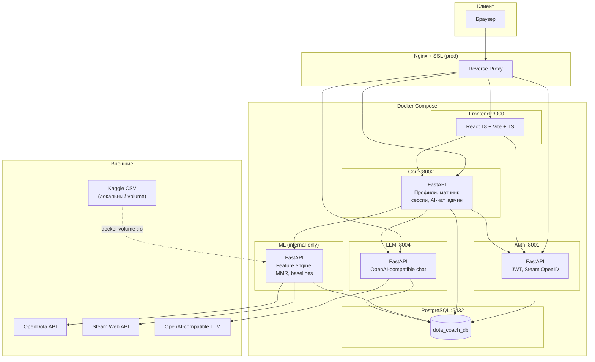

# Architecture

## Высокоуровневая схема

Платформа состоит из 5 независимых микросервисов плюс PostgreSQL, всё развёртывается через `docker-compose`. На продакшне фронт и API проксируются Nginx с SSL-терминацией.

## Сервисы — назначение и зоны ответственности

| Сервис | Порт | Public | Хранит |
|--------|------|--------|--------|
| **auth** | 8001 | да | `auth_users`, `auth_sessions`, `auth_roles`, `auth_providers` |
| **core** | 8002 | да | `core_users`, `player_profiles`, `coach_profiles`, `training_requests`, `training_sessions`, `coach_reviews`, `ai_advice_history`, `core_action_logs` |
| **ml** | — (только внутренний `http://ml:8003`) | **нет** | `ml_raw_*`, `ml_constants_*`, `ml_kaggle_baselines`, `ml_player_analyses`, `player_accounts`, `player_matches` |
| **llm** | 8004 | да | `llm_requests`, `llm_responses` |
| **frontend** | 3000 | да | — |

ML-сервис **намеренно не имеет публичного порта** — `core` проксирует все обращения и добавляет внутренний токен `X-Internal-Token`.

## Аутентификация и авторизация

### Между фронтом и публичными API

- Стандартный flow: `POST /auth/register` → `POST /auth/login` → access (30 мин) + refresh (30 дней).
- В каждый защищённый запрос отправляется заголовок `Authorization: Bearer <access_token>`.
- При истечении access — фронт делает silent `POST /auth/refresh` (refresh-rotation: старый refresh инвалидируется, выдаётся новый).
- Альтернативный логин — через **Steam OpenID 2.0**: `GET /auth/steam/login` → редирект на Valve → callback на `/auth/steam/callback` → выдача токенов через URL-фрагмент.
- Роли проверяются через `Depends(require_role("ADMIN"))` и аналоги в `core` и `auth`.
- Любая роль определяется внутри JWT (`role` claim) и подтверждается на каждом запросе по БД (`is_active`, текущая роль).

### Между сервисами

- `core → ml` и `core → llm` (в части служебных вызовов): обязательный заголовок `X-Internal-Token`, значение из `ML_INTERNAL_TOKEN`. Любой запрос к ML без него получает 401.
- `core → auth` (например, для проверки Steam-провайдера пользователя): обычный bearer-токен от пользователя пробрасывается as-is.
- `llm → внешний LLM`: HTTPS, токен `LLM_API_KEY`. При отсутствии ключа — детерминированный fallback (см. `services/llm/app/routers/chat.py`).

## Хранилище

Все сервисы используют **одну общую БД PostgreSQL 16** с разделением по префиксам таблиц:

- `auth_*` — пишет только `auth`.
- `core_*`, `player_profiles`, `coach_profiles`, `training_*`, `coach_reviews`, `ai_advice_*` — пишет только `core`.
- `ml_*`, `player_accounts`, `player_matches` — пишет только `ml`.
- `llm_*` — пишет только `llm`.

Связи между доменами хранятся через идентификаторы (`auth_user_id` в core, `player_profile_id` в ml-аналитике), без прямых FK между схемами разных сервисов.

Схема создаётся автоматически (`Base.metadata.create_all`) при старте каждого сервиса. Дополнительные индексы создаются миграцией `IF NOT EXISTS` в `startup` хуке (см. `services/core/app/main.py` и `services/ml/app/main.py`).

## Внешние интеграции

| Интеграция | Сервис | Назначение | Опционально |
|------------|--------|------------|-------------|
| **OpenDota API** | ml | Профиль, матчи, totals, рейтинги, парсинг | `OPENDOTA_API_KEY` опционален (поднимает лимит с 60 до 1200 RPM) |
| **Steam OpenID** | auth | Логин и привязка Steam | можно выключить флагом `STEAM_OPENID_ENABLED=false` |
| **Steam Web API** | ml | Резерв для закрытых профилей | требует `STEAM_API_KEY` |
| **OpenAI-compatible LLM** | llm | Генерация советов | без `LLM_API_KEY` — шаблонный fallback |
| **Kaggle Dataset** | ml | Baseline-статистика | смонтирован как read-only volume `./archive-2:/data/archive-2:ro` |

## Безопасность

- Каждый сервис добавляет security headers через middleware: `X-Content-Type-Options: nosniff`, `X-Frame-Options: DENY`, `Referrer-Policy: strict-origin-when-cross-origin`, `Permissions-Policy: camera=(), microphone=(), geolocation=()`.
- В `auth` дополнительно `Cache-Control: no-store`.
- Rate limiting (in-memory) на чувствительных эндпоинтах: register, login, refresh.
- Refresh-токены хранятся **только хешированными** (sha256), сравниваются `hmac.compare_digest`.
- Пароли — `bcrypt` через passlib.
- Steam-cookies (`steam_signup_role`, `steam_link_user_id`, `steam_consent_version`) — HMAC-подписанные, `HttpOnly`, `Secure`, `SameSite=Lax`, TTL 10 минут.
- CORS — закрытый whitelist через `CORS_ORIGINS`.
- Внутренние секреты (`JWT_SECRET`, `ML_INTERNAL_TOKEN`) обязательны — сервис отказывается стартовать с пустыми значениями (`_required` в `config.py`).
- Принудительный logout всех сессий через флаг `FORCE_REVOKE_ALL_SESSIONS=true` на старте `auth`.
